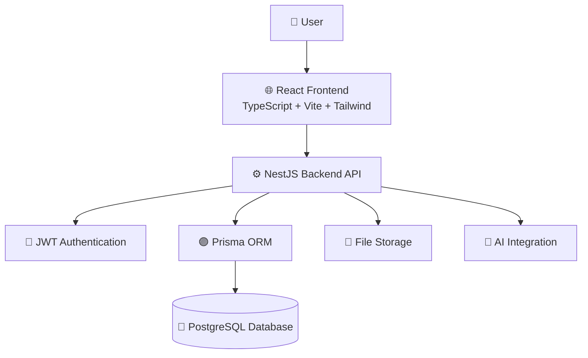
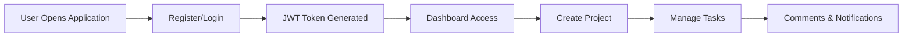
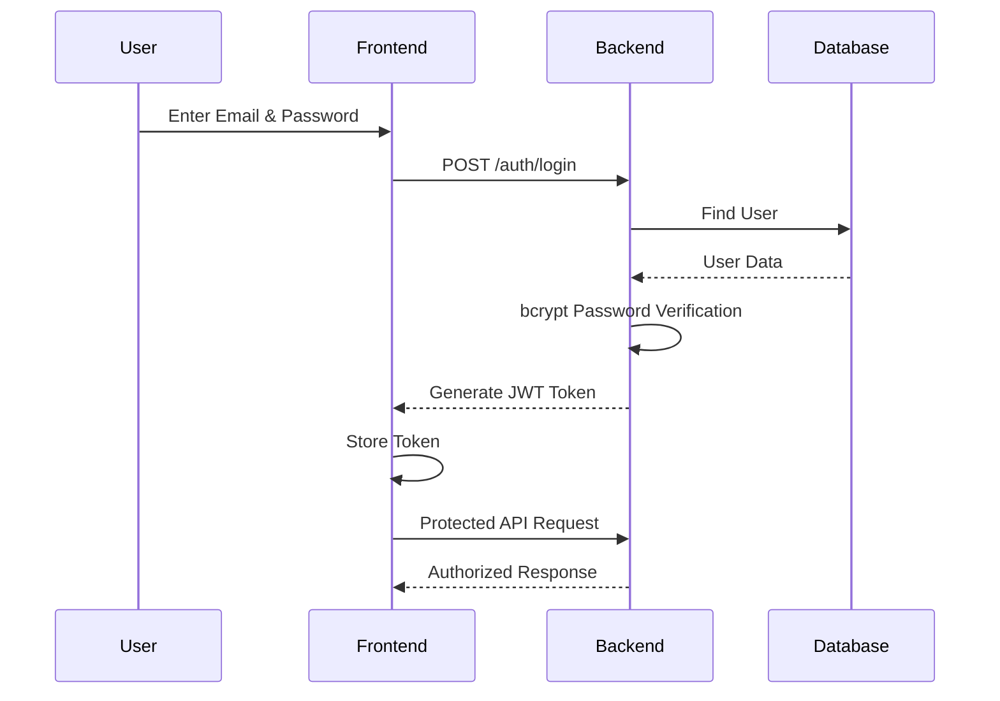
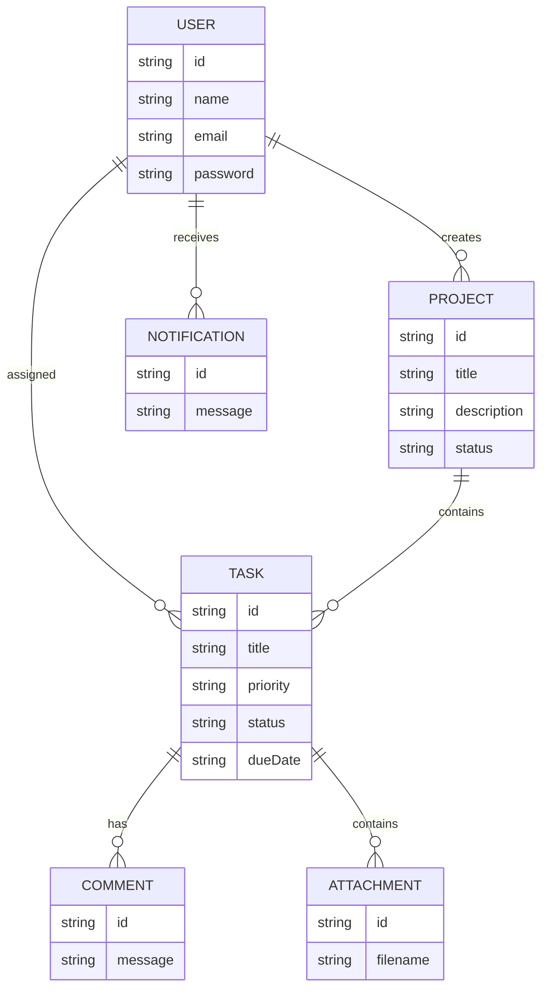
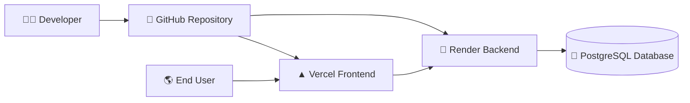

# 🚀 DevFlow AI

> An AI-powered project management workspace designed to help teams plan, collaborate, track tasks, and deliver projects efficiently.


---

# 🌐 Live Demo

## Frontend

🔗 https://devflow-ai-web-sable.vercel.app

## Backend API

🔗 https://devflow-api-q2p4.onrender.com

## Swagger API Documentation

🔗 https://devflow-api-q2p4.onrender.com/api

---

# 📌 About Project

DevFlow AI is a full-stack AI-ready project management platform built to simplify project planning, task tracking, and team collaboration.

The application provides secure authentication, project management, task workflows, comments, notifications, attachments, and a responsive dashboard.

The system follows a scalable full-stack architecture using:

- React + TypeScript for frontend
- NestJS for backend API
- Prisma ORM for database management
- PostgreSQL for persistent storage

---

# ✨ Key Features

## 🔐 Authentication

- User Registration
- Secure Login
- JWT Authentication
- Protected Routes
- Profile Management
- Password Update

## 📁 Project Management

- Create Projects
- Update Projects
- Delete Projects
- Manage Project Information
- Track Project Progress

## ✅ Task Management

- Create and Manage Tasks
- Assign Tasks
- Task Priority
- Task Status
- Due Dates
- Task Dependencies

## 🤝 Collaboration

- Task Comments
- Activity Tracking
- Notifications
- File Attachments

## ⚡ Additional Features

- Responsive Dashboard
- Swagger API Documentation
- Prisma Database Management
- Docker Support
- Production Deployment
- AI Integration Ready

---

# 🛠 Technology Stack

| Layer | Technology |
|---|---|
| Frontend | React 19, TypeScript, Vite |
| Styling | Tailwind CSS |
| Routing | React Router |
| Data Fetching | Axios, TanStack Query |
| Backend | NestJS |
| Database | PostgreSQL |
| ORM | Prisma |
| Authentication | JWT, Passport, bcrypt |
| API Documentation | Swagger |
| Deployment | Vercel + Render |

---

# 🏗 System Architecture



---

# 🔄 Application Workflow



---

# 📂 Project Structure

```text
devflow-ai/

├── apps/
│
│   ├── web/
│   │   ├── React Frontend
│   │   ├── Components
│   │   └── Pages
│   │
│   └── server/
│       ├── NestJS API
│       ├── Prisma
│       └── Database Models
│
├── packages/
│
├── docker-compose.yml
├── render.yaml
├── vercel.json
└── README.md
```

---

# 🔐 Authentication Flow



---

# 🗄️ Database Design (ER Diagram)



---

# ☁️ Deployment Architecture



---

# ⚙️ Local Setup

## Requirements

- Node.js 22+
- pnpm 11+
- PostgreSQL
- Docker (Optional)


## Clone Repository

```bash
git clone https://github.com/urwashi-kumari/devflow-ai.git

cd devflow-ai
```


## Install Dependencies

```bash
corepack enable

pnpm install
```

---

# Backend Setup

Go to server folder:

```bash
cd apps/server
```

Create `.env` file:

```env
PORT=3000

DATABASE_URL="your_database_url"

JWT_SECRET="your_secret_key"

FRONTEND_URL="http://localhost:5173"
```

Generate Prisma Client:

```bash
pnpm prisma generate
```

Run Database Migration:

```bash
pnpm prisma migrate dev
```

Start Backend:

```bash
pnpm start:dev
```

---

# Frontend Setup

Go to frontend:

```bash
cd apps/web
```

Create `.env`:

```env
VITE_API_URL=http://localhost:3000
```

Start Frontend:

```bash
pnpm dev
```

Frontend:

```
http://localhost:5173
```

Backend:

```
http://localhost:3000
```

---

# 🔌 API Documentation

## Authentication

```
POST   /auth/register

POST   /auth/login

GET    /auth/me
```


## Projects

```
GET    /projects

POST   /projects

PATCH  /projects/:id

DELETE /projects/:id
```


## Tasks

```
GET    /tasks

POST   /tasks

PATCH  /tasks/:id
```


## Health Check

```
GET /health
```

---

# 🚀 Production Deployment

## Frontend Deployment

Platform:

```
Vercel
```

Live URL:

```
https://devflow-ai-web-sable.vercel.app
```

Environment Variable:

```env
VITE_API_URL=https://devflow-api-q2p4.onrender.com
```


---

## Backend Deployment

Platform:

```
Render
```

Backend URL:

```
https://devflow-api-q2p4.onrender.com
```

Database:

```
PostgreSQL
```

ORM:

```
Prisma
```

---

# 🔒 Security Implementation

- Password hashing using bcrypt
- JWT based authentication
- Protected API routes
- Environment variables secured
- Database credentials excluded from Git
- CORS configured
- Authentication guards implemented

---

# 📸 Screenshots

Add screenshots in:

```
screenshots/
```

Recommended:

```
screenshots/

├── login.png

├── register.png

├── dashboard.png

└── projects.png
```

---

# ✅ Current Status

✅ Authentication System Completed

✅ User Profile Management

✅ Project Management

✅ Task Management

✅ Comments System

✅ File Attachments

✅ Notifications

✅ PostgreSQL Database

✅ Prisma ORM

✅ Swagger Documentation

✅ Frontend Deployment

✅ Backend Deployment


---

# 🔮 Future Improvements

- AI Project Suggestions
- Smart Task Recommendations
- Email Verification
- Forgot Password
- Role Based Access Control
- Real-Time Collaboration
- Advanced Analytics Dashboard
- Cloud File Storage
- Team Management


---

# 👩‍💻 Author

**Urwashi Kumari**

B.Tech Computer Science Engineering Student

GitHub:

https://github.com/urwashi-kumari


---

# ⭐ Support

If you like this project, consider giving it a ⭐ on GitHub.


---

# 📄 License

This project is licensed under the MIT License.